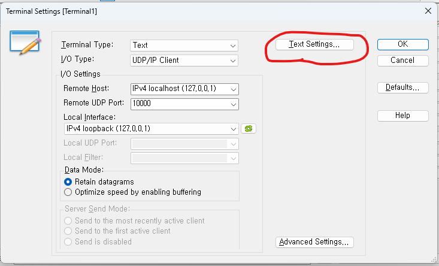
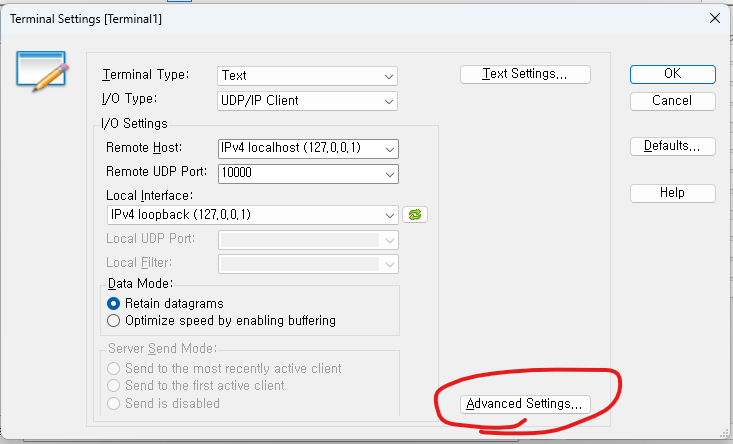

# UDP Maint Port를 이용한 RaspberryPi 개발

### RaspberryPi의 용도와 단위 동작 실행의 필요성
우리 프로젝트에서 RaspberryPi(이하 부터는 Pi라고 하겠습니다)는 가상의 제철 공정에 사용되는 장치로 활용됩니다. Python을 이용하여 GUI를 만들 수도 있겠지만 동작이 간단하고 기능이 단순하기 때문에 GUI는 만들지 않을 계획 입니다. GUI가 없다고 하더라도 몇가지 단위 동작을 조합한 시퀀스 동작이 있기 때문에 기능 구현을 단계적으로 검증 해가며 개발하기 위해서는 단위 동작을 하나씩 실행 시켜 볼 수 있는 방법이 필요 합니다. GUI를 간단하게 만드는 것도 생각 했지만 더 좋은 방법이 있습니다. 임베디드 시스템 개발 시 사용하는 RS232C 컴포트를 이용한 디버깅 방법 입니다. 조금 응용하면 간편하게 목적을 달성 할 수 있어보입니다. RS232C 컴포트를 이용하기에는 HW 준비도 필요하기 때문에 그와 유사한 UDP Socket 통신을 사용하도록 하겠습니다. 이 글에서는 내부 IP를 사용 했지만 실제로는 Pi의 IP와 노트북의 IP를 사용하면 됩니다.

### Terminal 프로그램 준비
먼저 사용자의 명령을 전달 할 Terminal 프로그램을 선정 합니다. 여러 무료 터미널 프로그램이 있는데 인터넷에서 검색하여 UDP Socket을 사용 할 수 있는 터미널 프로그램을 다운받아 사용합니다.

구글로 검색하니 Source Forge에 무료로 사용 할 수 있는 터미널 프로그램이 나와 있습니다. 저는 이중 YAT라는 프로그램을 사용하도록 하겠습니다.


Files 탭을 누르고 다운로드 수가 가장 많은 YAT-2.7.2_x64(64Bit)_installer.zip 을 다운 받습니다. 압축을 풀고 프로그램을 설치 합니다.
https://sourceforge.net/projects/y-a-terminal/files/


프로그램을 설치 후 프로그램을 실행합니다.


### YAT 프로그램 설정
저희가 사용하려는 목적에 맞도록 몇가지 설정을 변경 해줍니다.
1. UDP를 이용한 접속으로 변경
2. 텍스트 입력 후 엔터를 치면 종결문자가 자동으로 붙도록 설정
3. Time Stamp, Direction, Line Number 사용 설정


저희는 UDP를 사용하고 UDP/IP Client를 사용 합니다. Host와 Port는 적절히 조정해 줍니다. 저는 노트북 한대에서 터미널 프로그램과 파이썬 프로그램을 모두 실행 시킬 예정이라서 localhost로 설정하였고 포트는 10000을 사용하였습니다. 필요에 따라 적절히 조정 해주세요.


문자 송신 시에 CR LF를 붙여주어 Pi에 문자가 전달 되면 '\n'으로 명령 입력을 구분하도록 하겠습니다.


아래와 같이 EOL(End Of Line)로 CR LF를 선택 해줍니다. CR LF가 무엇인지 모른다면 별도로 공부 해주세요. 프로그래밍 할 때 '\r\n'을 말하는 것입니다.


다음으로 터미널 창을 좀더 보기 좋게 꾸미겠습니다. Advanced Settings로 들어갑니다.



라인 번호도 표시해주고 시간도 찍어주고 메시지 송수신 방향도 표시 해주면 좀더 편할 것 같습니다. 아래 옵션들을 변경 해주었습니다.


### 라즈베리파이 프로그램 처리

라즈베리파이에서 사용 할 코드를 준비합니다. UDP 소켓을 하나 생성하는데 sock.setblocking(False) 구문을 사용하여 non-blocking 모드로 설정 해줍니다. main_loop가 무한히 돌아가는 동안 Terminal로 부터 전달 된 문자를 전달 받아서 user_command에 쌓아주고 '\n'이 입력되면 하나의 명령이 완성된 것으로 인식 합니다. UDP Socket을 non-blocking 모드로 설정 했기 때문에 BlockingIOError Exception이 발생하는 것은 정상 상황이므로 별도로 처리 해줍니다.

``` python
import socket

user_command = ""  # 명령어를 저장할 문자열

def create_udp_socket():
    # UDP 소켓 생성
    sock = socket.socket(socket.AF_INET, socket.SOCK_DGRAM)
    sock.bind(('127.0.0.1', 10000))  # local port 10000
    # 소켓을 non-blocking 모드로 설정
    sock.setblocking(False)
    return sock

def check_terminal_command(sock):
    global user_command  # 전역 변수 사용
    try:
        # UDP로 데이터 수신 (버퍼 크기: 1024 바이트)
        data, addr = sock.recvfrom(1024)
        
        if len(data) <= 0:
            return
        
        # 받은 데이터를 문자열로 디코딩
        received = data.decode('utf-8')
        
        # 받은 데이터를 한 문자씩 처리
        for char in received:
            if char == '\n':  # 개행 문자를 만나면
                # 완성된 명령어 출력
                print(f"received command: {user_command}")
                user_command = ""  # 명령어 초기화
            else:
                # 개행이 아닌 문자는 명령어 문자열에 추가
                user_command += char
                
    except BlockingIOError:
        # 데이터가 없을 경우 발생하는 예외를 무시
        pass
    except Exception as e:
        print(f"error occurred: {e}")

def main_loop(sock):
    while True:
        # check_terminal_command를 계속 호출
        check_terminal_command(sock)

def main():
    try:
        # UDP 소켓 생성
        sock = create_udp_socket()
        print("UDP Server Start (local port: 10000)")
        
        # 메인 루프 실행
        main_loop(sock)
        
    except Exception as e:
        print(f"error occurred: {e}")
    finally:
        sock.close()

if __name__ == "__main__":
    main()

```

서버를 실행 시킵니다. 정상적으로 실행된 것을 확인 할 수 있습니다.
터미널도 기동 시켜 줍니다.

