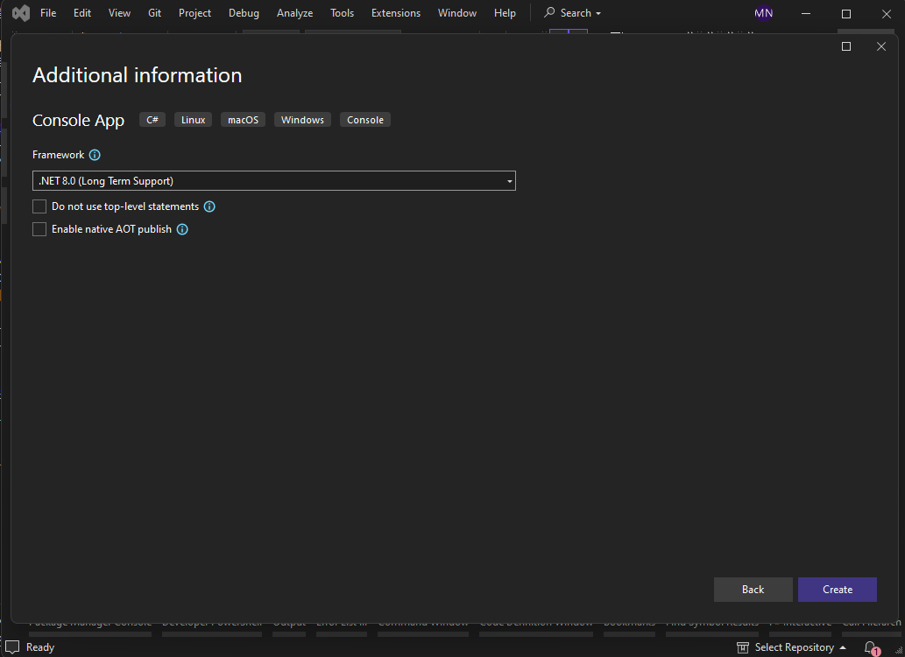
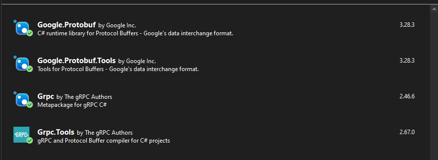

## gRPC를 이용한 서버스간 연결
MES 특성상 많은 기능이 서버스로 구성되어 있고, 서버스간 통신이 자주 발생한다. 서비스간의 통신을 하는데는 여러 방법들이 있다. 대표적인 방법으로 socket, Websocket, REST, gRPC가 있으며 각각의 특징은 다음과 같다.

### 각 통신방식 특징 및 장단점
특징 및 장단점은 아래 표와 같다. 이중 우리는 최근 MSA(Micro Service Architecture)에서 많이 사용되는 gRPC를 사용하였다.
| 통신방식 | 특징 | 장점 | 단점 |
|---------|------|------|------|
| Socket | - TCP/IP 기반의 저수준 통신<br>- 양방향 통신 가능<br>- 연결 지향적 | - 실시간 통신 가능<br>- 높은 성능과 낮은 지연시간<br>- 자유로운 프로토콜 설계 | - 구현이 복잡<br>- 프로토콜 설계 필요<br>- 보안 구현 필요 |
| WebSocket | - HTTP를 통한 초기 연결 후 양방향 통신<br>- 웹 표준 프로토콜<br>- 실시간 통신 지원 | - 실시간 양방향 통신<br>- 브라우저 지원<br>- HTTP 호환성 | - 연결 유지 필요<br>- 서버 리소스 소비<br>- 복잡한 상태 관리 |
| REST | - HTTP 기반의 단방향 통신<br>- 리소스 중심 설계<br>- 상태를 저장하지 않음 | - 단순하고 직관적<br>- 널리 사용됨<br>- 캐싱 가능 | - 오버헤드 발생<br>- 실시간 통신 어려움<br>- 대량 데이터 처리 비효율 |
| gRPC | - HTTP/2 기반의 RPC<br>- Protocol Buffers 사용<br>- 양방향 스트리밍 지원 | - 높은 성능<br>- 강력한 타입 체크<br>- 다양한 언어 지원 | - 학습 곡선이 높음<br>- 브라우저 직접 지원 없음<br>- 바이너리 포맷으로 디버깅 어려움 |


## 프로토타입 프로젝트 만들기
라즈베리파이를 이용하여 철강 후공정에서 사용하는 컨베이어 벨트 목업을 제작 예정이기 때문에 라즈베리파이에서 사용 할 파이썬 프로그램으로 서버를 만들고 MES 서버가 gRPC 클라이언트 역할을 하도록 하였다.


## 라즈베리파이 gRPC 서버 만들기
아래 순으로 프로그램을 만든다.
1. 프로젝트를 위한 폴더를 만든다.
2. python이 설치되어 있어야 한다. 설치가되어 있지 않다면 설치한다.
3. pyGrpcServerHello.py 파일을 하나 생성한다.
4. protos 폴더를 하나 생성하고 hello.proto 파일을 넣어둔다.
5. 필요한 패키지들을 설치해야하는데 글로벌로 설치되어 있는 패키지들과 충돌이 있을 수 있으므로 가상 환경을 만들어서 로컬로 설치 한다.
6. python 서버 코드를 작성하고 파이썬 코드를 실행 시킨다.

### gRPC 사전학습
gRPC는 Google이 만들어 오픈소스로 공개한 다기종 연결을 위한 프레임워크이다.
메뉴얼이 매우 체계적으로 잘 정리되어 있어서 학습이 용이하다.
gRPC 공식 홈페이지 : https://grpc.io/


### 프로그램 개발 툴
파이썬 개발을 위해 VS Code를 많이 사용하지만 최근에는 CURSOR라는 IDE가 나왔다. 이 IDE는 VS Code에 AI기능이 추가되어 프로그램 개발이 매우 원활하여 해당 IDE를 사용하게 되었다. 아래 링크에서 다운받아 설치하여 사용한다.
https://www.cursor.com/


### 1. 가상 환경 설정
가상 환경 설치를 위해서 터미널 창을 연다. IDE에서 터미널 창을 열어서 명령을 수행 할 수 있으므로 그렇게 진행하였다. cursor IDE에서 (ctrl + shift + `)를 누르면 새로운 터미널이 IDE 하단에 나타난다.
``` powershell
#powershell
# 가상 환경 생성
python -m venv venv

# 가상 환경 활성화
.\venv\Scripts\Activate
```
### 2. gRPC 패키지 설치
gRPC 사용을 위해 grpcio와 grpcio-tools라는 파이썬 패키지를 설치한다.
``` powershell
#powershell
pip install grpcio grpcio-tools
```
### 3. hello.proto 파일 작성
기본 예제에 ReqemoteCommand라는 rpc를 추가하였고 RcmdRequest와 RcmdReply라는 메시지를 추가하였다.

``` proto
syntax = "proto3";

package hello;

// 서비스 정의
service Greeter {
    rpc SayHello (HelloRequest) returns (HelloReply) {}
    rpc ReqRemoteCommand (RcmdRequest) returns (RcmdReply) {}
}

// 요청 메시지
message HelloRequest {
    string name = 1;
}

// 응답 메시지
message HelloReply {
    string message = 1;
}

message RcmdRequest {
    string command = 1;
    string param = 2;
}

message RcmdReply {
    string ack = 1;
}

```
### 4. 프로토 파일 컴파일
이미 설치된 grpc_tools.protoc를 이용하여 hello.proto 파일을 컴파일한다.
``` powershell
#powershell
# Python 파일로 컴파일
python -m grpc_tools.protoc -I. --python_out=. --grpc_python_out=. hello.proto
```
컴파일을 하고나면 아래와 같은 2개의 파일이 생성된다.

```
hello_pb2.py
hello_pb2_grpc.py
```
### 5. gRPC 서버 프로그램 작성
포트는 50051로 하였고 client로 부터 요청이 오면 어떤 client로 부터 요청을 받았는지 print하도록 되어 있다. 각 RPC(Remote Procesure Call) 호출 시 action 수행 후 회신을 하도록 하였다.
``` python
import grpc
from concurrent import futures
import time
import hello_pb2
import hello_pb2_grpc

class GreeterServicer(hello_pb2_grpc.GreeterServicer):
    def SayHello(self, request, context):
        print(f"received SayHello from {request.name}")
        message = f"Hello, {request.name}!"
        return hello_pb2.HelloReply(message=message)
    def ReqRemoteCommand(self, request, context):
        print(f"received RCMD, RCMD= {request.command}, PARAM= {request.param}!")
        # TODO: 명령을 처리하는 부분 구현
        return hello_pb2.RcmdReply(ack="OK")

def serve():
    server = grpc.server(futures.ThreadPoolExecutor(max_workers=10))
    hello_pb2_grpc.add_GreeterServicer_to_server(GreeterServicer(), server)
    server.add_insecure_port('[::]:50051')
    server.start()
    print("Server started on port 50051")
    
    try:
        while True:
            time.sleep(86400)
    except KeyboardInterrupt:
        server.stop(0)

if __name__ == '__main__':
    serve()
```
### 6. 서버 실행
가상 환경이 활성화된 상태에서 서버를 실행 합니다.
``` powershell
#powershell
python hello_server.py
```

### 7. 시행 착오
#### python이 설치되어 있지 않음
python 프로그램을 실행시키기 위해서는 pytho이 설치되어 있어야 한다. google에서 python을 검색한 후 python을 다운받아 설치한다.

#### 7-1. python 명령이 실행되지 않는다
python 패키지 설치 시 실패하는 경우가 있다. python을 글로벌로 실행 시키기 위해서는 python이 설치된 경로가 환경변수에 등록되어 있어야 한다. 파이썬이 설치된 경로를 확인하여 아래 두 경로를 환경변수 Path에 등록한다.
```
C:\Users\user\AppData\Local\Programs\Python\Python312
C:\Users\user\AppData\Local\Programs\Python\Python312\Scripts
```
#### 7-2. 파워쉘 명령이 실패한다
* IDE를 관리자 권한으로 실행 해본다.
* 파워쉘을 관리자권한으로 실행시켜서 파워쉘 명령을 수행 해본다.
* 명령프롬프트를 관리자권한으로 실행시켜서 명려을 수행 해본다.

#### 7-3. 프로토 파일이 컴파일 되지 않음
프로토 파일을 컴파일 하는 과정에서 파로토 파일의 위치 지정을 잘못해서 그런 경우가 많다. hello.proto 파일의 경로를 확인해서 적절한 위치로 설정 한다.
``` powershell
#powershell
# Python 파일로 컴파일
python -m grpc_tools.protoc -I. --python_out=. --grpc_python_out=. hello.proto
```
#### 7-4. 서버 실행 시 파이썬 코드에 에러가 발생 한다
서버 프로그램이 잘못되어 있는 경우가 있으므로 소스코드를 확인해서 코드를 수정하거나 처음부터 차근 차근 다시 진행해보면 대부분 해결 된다.

#### 7-5. 기타 시행 착오는 구글과 함께
나머지 사항은 구글을 통해 해결방법을 검색하거나 멘토에게 문의 한다.

### 8. 소스코드
github에 업로드된 소스코드를 참고하세요. [ [github](https://github.com/jade-na/anu24SteelMES/tree/0fb941a1adaa21d59ea78701cd0a8e70d5ededa5/src/prototypes/pyGrpcServer) ]


---
## C# gRPC 클라이언 프로그램 만들기
Microsoft에서는 C#의 기본 RPC로 gRPC를 채택하여 사용하고 있기 때문에 .NET을 이용해서 gRPC를 사용 할 경우 더욱 편리하게 이용 할 수 있다. C# 사용자는 다음 사이트를 참고 하길 바란다. (https://learn.microsoft.com/ko-kr/aspnet/core/grpc/?view=aspnetcore-8.0)

### 1. C# 콘솔 어플리케이션 생성
서버 프로그램이 만들어 졌으니 서버의 서비스를 호출 할 클라이언트 프로그램을 만들어 봅시다. C# 콘솔 어플리케이션으로 클라이언트 프로그램을 간략히 작성해 보도록 하겠습니다. 아래와 같이 C# 콘솔 어플리케이션 프로젝트를 생성합니다.


### 2. 프로젝트 이름 지정
프로젝트 이름은 grpcSharpClient2로 하겠습니다.


### 3. Framework 선택
Framework는 기본값인 .NET 8.0으로하고 넘어가겠습니다.


### 4. gRPC를 위한 패키지들을 설치 합니다.
NutGet 패키지 매니저를 실행 시켜서 다음 4가지 패키지들을 찾아 설치해줍니다.
```
Grpc
Grpc.Tools
Google.Protobuf
Google.Protobuf.Tools
```


### 5. 프로토 파일 복사
프로젝트 폴더 아래에 protos 폴더를 생성하고 서버 프로그램을 작성 할 때 사용 했던 hello.proto 파일을 넣어 둡니다. 서버와 동일한 프로토 파일을 사용 하겠습니다.


### 5. 프로토 파일 컴파일
C#에서는 .proto 파일을 포함하면 자동으로 컴파일하여 코드가 생성됩니다. 프로젝트를 더블클릭하여 다음과 같이 ItemGroup으로 Protobuf를 추가 해줍니다.


### 6. 솔루션 빌드 수행
지금까지 과정에 문제가 없는지 확인하기 위해 빌드를 한번 해줍니다. 빌드에 문제가 없다면 다음 단계로 넘어 갑니다.


### 7. RPC 호출 구문 구현
gRPC 서버와 접속을 위해 channel을 생성해서 client service를 생성된 channel과 연결하여 생성합니다. 그 이후 SayHello 및 ReqRemoteCommand RPC를 호출 해봅니다.
``` CSharp
// See https://aka.ms/new-console-template for more information
using Grpc.Core;
using Hello;

Channel channel = new Channel("127.0.0.1:50051", ChannelCredentials.Insecure);
var client = new Greeter.GreeterClient(channel);
string user = "C# Client";

var reply = client.SayHello(new HelloRequest { Name = user });
Console.WriteLine("SayHello Reply " + reply.Message);

var reply2 = client.ReqRemoteCommand(new RcmdRequest{ Command = "컨베이어야 돌아라", Param = "빨리"});
Console.WriteLine("Rcmd Ack is " + reply2.Ack);


channel.ShutdownAsync().Wait();
Console.WriteLine("Press any key to exit...");
Console.ReadKey();
```

### 8. 클라이언트 프로그램 실행
python으로 작성된 서버를 실행 시킨 후 클라이언트 프로그램을 실행 시킵니다. 클라이언트 프로그램이 실행될 때마다 서버의 RPC가 호출되는 것을 확인 할 수 있습니다.


### 7. 시행 착오
#### 7-1. 프로토 파일 빌드 되지 않음
7단계(RPC 호출 구문) 구현 전에 빌드를 했을 때 빌드가 되지 않는 경우가 있습니다. 프로토 파일 지정을 잘못 해주었거나 패키지 설치를 잘못 했을 경우 빌드가 안될 수 있습니다. <ItemGroup>을 패키지 위쪽에 넣어 주세요.
```xml
<Project Sdk="Microsoft.NET.Sdk">

  <PropertyGroup>
    <OutputType>Exe</OutputType>
    <TargetFramework>net8.0</TargetFramework>
    <ImplicitUsings>enable</ImplicitUsings>
    <Nullable>enable</Nullable>
  </PropertyGroup>

  <ItemGroup>
    <Protobuf Include="protos\hello.proto" />
  </ItemGroup>

  <ItemGroup>
    <PackageReference Include="Google.Protobuf" Version="3.28.3" />
    <PackageReference Include="Google.Protobuf.Tools" Version="3.28.3" />
    <PackageReference Include="Grpc" Version="2.46.6" />
    <PackageReference Include="Grpc.Tools" Version="2.67.0">
      <PrivateAssets>all</PrivateAssets>
      <IncludeAssets>runtime; build; native; contentfiles; analyzers; buildtransitive</IncludeAssets>
    </PackageReference>
  </ItemGroup>

</Project>
```
#### 7-2. 기타 시행 착오
그 밖의 시행착오는 구글을 통해 해결 방법을 찾거나 멘토에게 문의 해주세요.

### 8. 소스 코드
github에 업로드된 소스코드를 참고하세요. [ [github](https://github.com/jade-na/anu24SteelMES/tree/0fb941a1adaa21d59ea78701cd0a8e70d5ededa5/src/prototypes/pyGrpcServer) ]
