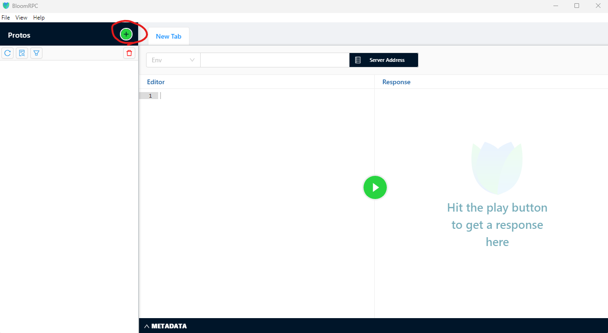
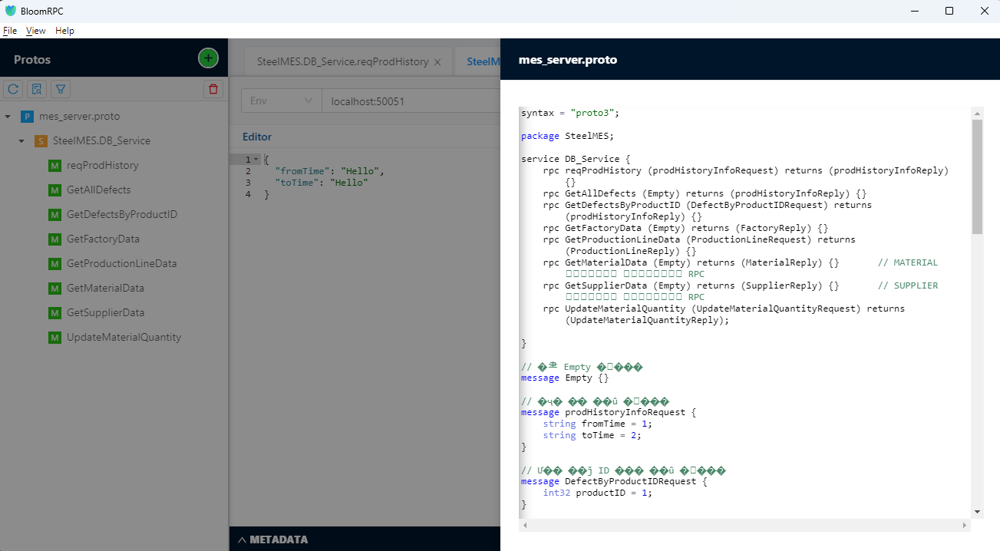

# gRPC 테스트
## BloomRPC 프로그램 설치
gRPC Server를 테스트 할 수 있는 여러 프로그램이 존재 합니다. 저희는 이중 BloomRPC라는 프로그램을 이용하여 저희가 만든 gRPC 서버를 실행 시켜 기능을 점검 해보도록 하겠습니다.

BloomRPC는 gRPC 서비스를 테스트하기 위한 GUI 클라이언트 도구입니다. Postman과 유사하게 작동하며 다음과 같은 주요 특징을 가지고 있습니다:

- .proto 파일을 드래그 앤 드롭으로 쉽게 불러올 수 있음
- 서비스와 메서드를 트리 구조로 시각적으로 보여줌
- 요청/응답 데이터를 JSON 형식으로 쉽게 편집 가능
- 단방향(Unary) 및 스트리밍 호출 모두 지원
- 메타데이터 추가 및 TLS/SSL 설정 가능
- 여러 환경에서의 테스트를 위한 워크스페이스 관리 기능 제공

이러한 기능들을 통해 개발자는 gRPC 서비스를 쉽게 테스트하고 디버깅할 수 있습니다.

BloomRPC는 오픈소스 프로그램으로 github에서 다운로드 받을 수 있습니다.
https://github.com/bloomrpc/bloomrpc

github에 접속하여 Tags를 클릭 합니다.

저희는 최신 버전을 다운받아 설치 하도록 하겠습니다.

각 운영체제 및 플랫폼 별 설치 파일들이 있습니다. 이중에서 저희는 아래 파일을 다운받아 설치 하겠습니다.

프로그램 설치 후 프로그램을 실행하면 아래와 같은 실행 화면을 볼 수 있습니다.

## BloomRPC를 이용한 gRPC 서버 디버깅
먼저 테스트 할 proto 파일을 로드 합니다. Import Protos 버튼을 누르면 proto 파일을 선택 할 수 있습니다.

저희가 작성한 mes_server.proto 파일을 사용 하도록 하겠습니다.

테스트를 하기 전에 저희가 만든 gRPC 서버 프로그램을 실행 시킵니다.

1. 보내고자하는 메시지를 선택합니다.
2. gRPC 서버의 주소와 포트를 입력 합니다.
3. 요청을 보낼 때 파라메터가 필요하다면 파라메터를 지정 합니다.
4. 전송 버튼을 눌러서 gRPC 서버에 메시지를 보냅니다.

BloomRPC 프로그램에서 proto 파일도 직접 확인 할 수 있으니 테스트 진행 시 참고 하세요.

gRPC 서버 소스코드를 디버깅 모드(F5)로 실행 시키고 함수에 브레이크 포인터를 지정(F9)한 후 RPC를 호출하여 디버깅을 진행 합니다.

이렇게 gRPC Client가 준비 되기 전에 gRPC Server의 동작이 정상적인지 테스트 해볼 수 있습니다.
