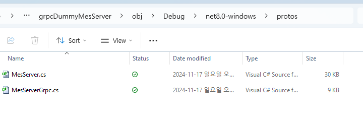
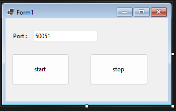

## gRPC를 MES 프로젝트에 적용하기

### Client 프로그램에 데이터 표시 하기
저희 프로젝트에는 아래 화면과 같은 요구사항 및 기능이 존재합니다.
이 기능의 구현 개념과 과정을 통해서 gRPC에 대해서 좀더 깊이 이해해 보도록 하겠습니다.


### MES Server가 없다면 데이터는 어떻게 표시 할 것인가?
조회 버튼을 눌렀을 때 데이터 그리드에 정보를 추가하려면 아래와 같은 형태의 코드가 필요 할 것입니다.

```csharp
   private void button6_Click(object sender, EventArgs e)
   {
        dataGridView1.Rows.Add("제품명", "S/N", "LOTID","불량명", "시간");       
   }
```

제품명, S/N, LOTID, 불량명, 시간을 하나의 데이터 형식으로 묶어서 관리하면 편할 것 같으니 클래스로 만드는게 좋을 것 같습니다. 따라서 아래와 같은 클래스를 하나 만들어 줍니다. 이 코드는 개념을 설명하기 위한 것이고 실제로 사용되지 않을 코드 입니다.

``` csharp
    public class prodHistoryInfo : Object
    {
        public prodHistoryInfo(String prodName, String sn, String lotId, String defactCode, DateTime dt) 
        {
            _prodName = prodName;
            _serialNum = sn;
            _lotId = lotId;
            _defactCode = defactCode;
            _produceDay = dt;
        }

        public String _prodName;
        public String _serialNum;
        public String _lotId;
        public String _defactCode;
        public DateTime _produceDay;
    }

```

저희는 prodHistoryInfo를 어떤 함수를 통해서 받아오면 코드가 간결해지고 분명해 지겠군요. 따라서 다음과 같은 함수를 기대 합니다.

``` csharp
    // 함수명 : 제품의 생산 이력을 요청 한다.
    // 파라메터 : 조회를 위해 시작일과 종료일을 지정한다.
    // 반환 : prodHistoryInfo 타입을 Queue에 넣어서 여려개 반환한다.
    Queue<prodHistoryInfo> reqProdHistory(DateTime startTime, DateTime endTime); 
```

이 함수의 형태도 좋지만 파라메터도 클래스 형태로 만들고 반환받는 부분도 좀더 다듬어 봅시다.

``` csharp
    public class prodHistoryInfoReply : Object
    {
        public prodHistoryInfoReply()
        {
        }
        int errorCode; // 반환 결과
        Queue<prodHistoryInfo> prodHistoryInfos;
    }

    public class prodHistoryInfoRequest : Object
    {
        public prodHistoryInfoRequest()
        {            
        }
        String startTime; // yyyy-mm-dd hh:mm:ss
        String endTime;   // yyyy-mm-dd hh:mm:ss
    }
```

이렇게 함수의 형태를 다듬는다면 아래와 같은 형태가 될 것입니다.

``` csharp
    // 함수명 : 제품의 생산 이력을 요청 한다.
    // 파라메터 : 조회를 위해 시작일과 종료일을 지정한다.
    // 반환 : prodHistoryInfo 타입을 Queue에 넣어서 여려개 반환한다. 반역 함수 호출 실패 시 에러값을 반환한다.
    prodHistoryInfoReply reqProdHistory(prodHistoryInfoRequest req);
```

함수의 형태가 지난 시간에 실습했던 gRPC의 service와 message 형태와 비슷해졌습니다.
이런 함수들은 DB 조회라는 유사한 목적과 용도를 가지고 있으니 DB_Service라는 클래스를 만들어서 함수들을 모아두면 좀더 편리 할 것 같습니다. 따라서 다음과 같은 클래스를 만들어 줍니다.

``` csharp
    public class DB_Service : Object
    {
        public DB_Service()
        {
        }

        // 함수명 : 제품의 생산 이력을 요청 한다.
        // 파라메터 : 조회를 위해 시작일과 종료일을 지정한다.
        // 반환 : prodHistoryInfo 타입을 Queue에 넣어서 여려개 반환한다. 반역 함수 호출 실패 시 에러값을 반환한다.
        public prodHistoryInfoReply reqProdHistory(prodHistoryInfoRequest req)
        {
            // 테스트를 위해 가짜 데이터를 만들어서 넣어 주도록 하겠습니다.
            // req.startTime, req.endTime을 이용하여 DB 데이터를 조회한다.
            // 조회된 DB 정보를 prodHistoryInfoReply에 채워서 반환 한다.
            prodHistoryInfoReply reply = new prodHistoryInfoReply();
            reply.errorCode = 0; // no error, error가 있을 때는 error code를 정의해서 반환
            reply.prodHistoryInfos.Enqueue(new prodHistoryInfo("A", "0001", "lot A", "defact A", DateTime.Now));
            reply.prodHistoryInfos.Enqueue(new prodHistoryInfo("B", "0002", "lot A", "defact B", DateTime.Now));

            return reply;
       }
    }
```

전체적인 코드를 보면 아래와 같습니다.

``` csharp

namespace Project_SteelMES
{
    public class prodHistoryInfo : Object
    {
        public prodHistoryInfo(String prodName, String sn, String lotId, String defactCode, DateTime dt) 
        {
            _prodName = prodName;
            _serialNum = sn;
            _lotId = lotId;
            _defactCode = defactCode;
            _produceDay = dt;
        }

        public String _prodName;
        public String _serialNum;
        public String _lotId;
        public String _defactCode;
        public DateTime _produceDay;
    }

    public class prodHistoryInfoReply : Object
    {
        public prodHistoryInfoReply()
        {
            prodHistoryInfos = new Queue<prodHistoryInfo>();
        }
        public int errorCode=0; // 반환 결과
        public Queue<prodHistoryInfo> prodHistoryInfos;
    }

    public class prodHistoryInfoRequest : Object
    {
        public prodHistoryInfoRequest(String tStart, String tEnd)
        {
            startTime = tStart;
            endTime = tEnd;
        }
        public String startTime; // yyyy-mm-dd hh:mm:ss
        public String endTime;   // yyyy-mm-dd hh:mm:ss
    }

    public class DB_Service : Object
    {
        public DB_Service() 
        { 
        }

        // 함수명 : 제품의 생산 이력을 요청 한다.
        // 파라메터 : 조회를 위해 시작일과 종료일을 지정한다.
        // 반환 : prodHistoryInfo 타입을 Queue에 넣어서 여려개 반환한다. 반역 함수 호출 실패 시 에러값을 반환한다.
        public prodHistoryInfoReply reqProdHistory(prodHistoryInfoRequest req) 
        {
            // 테스트를 위해 가짜 데이터를 만들어서 넣어 주도록 하겠습니다.
            // req.startTime, req.endTime을 이용하여 DB 데이터를 조회한다.
            // 조회된 DB 정보를 prodHistoryInfoReply에 채워서 반환 한다.
            prodHistoryInfoReply reply = new prodHistoryInfoReply();
            reply.errorCode = 0; // no error, error가 있을 때는 error code를 정의해서 반환
            reply.prodHistoryInfos.Enqueue(new prodHistoryInfo("A", "0001", "lot A", "defact A", DateTime.Now));
            reply.prodHistoryInfos.Enqueue(new prodHistoryInfo("B", "0002", "lot A", "defact B", DateTime.Now));
            reply.prodHistoryInfos.Enqueue(new prodHistoryInfo("C", "0003", "lot A", "defact C", DateTime.Now));
            reply.prodHistoryInfos.Enqueue(new prodHistoryInfo("D", "0004", "lot A", "defact D", DateTime.Now));
            reply.prodHistoryInfos.Enqueue(new prodHistoryInfo("E", "0005", "lot A", "defact E", DateTime.Now));
            reply.prodHistoryInfos.Enqueue(new prodHistoryInfo("F", "0006", "lot A", "defact F", DateTime.Now));

            return reply;
        }
    }
    public partial class Lost2 : LostForm
    {
        public Lost2()
        {
            db_service = new DB_Service();
            InitializeComponent();
        }
        DB_Service db_service;

        private void Lost2_Load(object sender, EventArgs e)
        {

        }

        private void button6_Click(object sender, EventArgs e)
        {
            // 제품명, S/N, LOTID, 불량명, 시간
            var reply = db_service.reqProdHistory(new prodHistoryInfoRequest("2024-11-16 00:00:00", "2024-11-16 23:59:59"));
            if(reply.errorCode == 0)
            {
                foreach (var h in reply.prodHistoryInfos)
                {
                    dataGridView1.Rows.Add(h._prodName, h._serialNum, h._lotId, h._defactCode, h._produceDay.ToString());
                }
            }
            else
            {
                // error message
            }
        }
    }
}
```

이렇게 DB_Service라는 클래스가 제공하는 reqProdHistory 함수를 통해서 원하는 정보의 조건을 함수의 인자로 전달하고 해당 조건에 맞는 데이터를 prodHistoryInfoReply 클래스로 전달 받을 수 있었습니다.
RPC는 이러한 함수가 원격에 있고 이런 원격에 있는 함수들을 호출해서 사용하는 방식이라고 생각하시면 됩니다.

* 서비스 : 유사한 기능들을 묶어서 어떠어떠한 서비스라고 이름 붙인 것
* 함수명 : reqProdHistory와 같이 특정한 기능을 정의하는 함수의 이름
* 메시지 : 함수 호출 시 전달하는 매개 변수, 그리고 함수 호출 후 반환 받는 데이터의 정의

### reqProdHistory 함수의 발전 과정
함수의 변화 과정을 살펴 보면 gRPC의 서비스와 메시지가 왜 그런 형태가 되었는지 좀더 이해하는데 도움이 될 것 입니다. 

``` csharp
    // 1단계 : from, to 시간을 인자로 넣어 주면 생산 이력을 prodHistoryInfo 클래스에 담아서 반환한다.
    prodHistoryInfo reqProdHistory(String fromTime, String toTime);

    // 2단계 : from, to 시간을 인자로 넣어 주면 생산 이력을 Queue<prodHistoryInfo>에 담아서 목록 형태로 반환한다.
    Queue<prodHistoryInfo> reqProdHistory(String fromTime, String toTime);

    // 3단계 : 매개변수는 prodHistoryInfoRequest 클래스로 만들고 반환 타입도 prodHistoryInfoReply 클래스로 만들어서 하나의 타입으로 정의하여 좀더 간편하게 한다. 
    prodHistoryInfoReply reqProdHistory(prodHistoryInfoRequest request);

```

---
### gRPC로 바꿔 보자
다음으로는 MES Server 프로그램을 만들고 MES Client에서 MES Server에 구현되어 있는 RPC를 호출해서 생산 이력을 얻어오는 데모 프로그램을 만들어 보도록 하겠습니다.

#### mes_server.proto 파일 만들기
먼저 gRPC를 위해서 proto 파일을 만들어 줍니다. 함수를 정의 해주고 함수에서 사용하는 메시지를 정의 해줍니다. proto 파일에서 컨테이너 형태로 데이터를 형을 만들 때 repeated라는 예약어를 사용 합니다. 저희는 불량 이력 요청 후 응답을 받을 때 prodHistoryInfo를 여러개 전달 받기를 원하므로 아래와 같이 proto 파일을 정의 하였습니다.

``` proto
syntax = "proto3";

package SteelMES;

// 서비스 정의
service DB_Service {
    rpc reqProdHistory (prodHistoryInfoRequest) returns (prodHistoryInfoReply) {}
}

// 제품 불량 이력 요청 메시지
message prodHistoryInfoRequest {
    string fromTime = 1;
    string toTime = 2;
}

// 제품 불량 이력 정보
message prodHistoryInfo {
    string prodName = 1;
    string serialNum = 2;
    string lotId = 3;
    string defactCode = 4;
    string produceDay = 5;    
}

// 제품 불량 이력 응답 메시지
message prodHistoryInfoReply {
    int32 errorCode = 1;
    repeated prodHistoryInfo infos = 2;
}
```

### MES Server 프로그램에 gRPC 기능 넣기
proto 파일이 만들어 졌으니 이제 서버 프로그램을 구성해 보도록 하겠습니다. gRPC를 연결하는 것은 지난 시간에 진행 했던 사항과 동일하니 간략히 설명하도록 하겠습니다.

#### 프로젝트 생성 및 gRPC 셋팅

1. winform 프로젝트를 생성해줍니다.
  -. 저는 프로젝트 이름을 grpcDummyMesServer라고 하였습니다.
2. gRPC관련 페키지들을 설치 해줍니다. 아래 4개
  -. grpc.core, grpc.tools, protobuf, protobuf.tools
3. protos 폴더를 만들고 앞에서 만든 mes_server.proto 파일을 넣어둡니다.
4. 프로젝트 파일에 프로토파일을 지정 해줍니다.
```xml
  <ItemGroup>
    <Protobuf Include="protos\mes_server.proto" />
  </ItemGroup>
```
5. 빌드를 한번 해줍니다.

현재까지의 과정은 지난 시간에 진행 했던 내용과 유사하므로 큰 문제가 없다면 다음 경로에서 grpc가 생성한 소스코드를 볼 수 있을 것입니다.
".\obj\Debug\net8.0-windows\protos\" 폴더



#### 간단한 UI 구성

gRPC 서비스를 시작 또는 멈출 수 있도록 버튼을 만들고 포트를 변경 할 수 있도록 간단한 UI를 구성 해줍니다.



#### DBServiceServer 클래스 만들기
gRPC 클라이언트에서 함수 호출이 되었을 때 함수의 역할을 수행하는 루틴을 만듭니다. proto 파일을 컴파일 해서 자동으로 생성된 코드에 포함되어 있는 클래스들을 활용하기 위해서 Grpc.Core 네입스페이스와 SteelMES 네입스페이스를 추가 합니다. 서버 클래스는 DB_Service.DB_ServiceBase 클래스를 상속 받아 만듭니다.

``` csharp
using System;
using System.Threading.Tasks;
// 아래 2가지 네임스페이스를 추가 해줍니다. SteelMES는 저희가 proto 파일 정의 시 package 명으로 입력한 것입니다.
using Grpc.Core;
using SteelMES;

namespace grpcDummyMesServer
{
    public class DBServiceServer : DB_Service.DB_ServiceBase
    {
       
    }
}
```

다음으로 클라이언트에서 함수를 호출하면 해당 함수를 처리하는 루틴을 추가 해줍니다. 원래는 prodHistoryInfoRequest를 통해서 전달되는 fromTime, toTime을 이용하여 DB에서 정보를 취득 후 정보를 전달 해줘야 하는데 해당 과정을 생략하고 더미 데이터로 대체 하였습니다. 이렇게 하면 함수 처리 루틴을 완성 되었습니다.

``` csharp
using System;
using System.Threading.Tasks;
// 아래 2가지 네임스페이스를 추가 해줍니다. SteelMES는 저희가 proto 파일 정의 시 package 명으로 입력한 것입니다.
using Grpc.Core;
using SteelMES;

namespace grpcDummyMesServer
{
    public class DBServiceServer : DB_Service.DB_ServiceBase
    {
        public override Task<prodHistoryInfoReply> reqProdHistory(prodHistoryInfoRequest request, ServerCallContext context)
        {
            // request.FromTime;
            // request.ToTime;
            var result = new prodHistoryInfoReply();

            result.ErrorCode = 0;

            var info1 = new prodHistoryInfo();
            info1.ProdName = "A";
            info1.SerialNum = "0001";
            info1.LotId = "LOT A";
            info1.DefactCode = "DEFACT A";
            info1.ProduceDay = "2024-11-17 00:00:00";
            result.Infos.Add(info1);

            var info2 = new prodHistoryInfo();
            info2.ProdName = "B";
            info2.SerialNum = "0002";
            info2.LotId = "LOT A";
            info2.DefactCode = "DEFACT B";
            info2.ProduceDay = "2024-11-17 00:00:10";
            result.Infos.Add(info2);

            return Task.FromResult(result);
        }
    }
}
```

#### 서비스 시작 및 종료 부분 처리
클라이언트로 부터 들어오는 접속 요청을 수신하기 위해서 Server 객체를 멤버로 하나 만들어 줍니다.

``` csharp
namespace grpcDummyMesServer
{
    public partial class Form1 : Form
    {
        Server grpcServer = null;

        public Form1()
        {
            InitializeComponent();
        }

```

다음으로 start 버튼을 눌렀을 때 Server 객체를 생성해주고 앞에서 만든 DBServiceServer 객체를 바인딩해주고 UI로 부터 가져온 포트 번호를 할당해 줍니다. Server 객체가 생성된 이후에는 Start() 함수를 호출하여 서버를 시작 시켜 줍니다.

``` csharp
        private async void button1_Click(object sender, EventArgs e)
        {
            if (grpcServer != null)
            {
                MessageBox.Show("gRPC Server is already running.");
                return;
            }

            //cancellationTokenSource = new CancellationTokenSource();
            
            int port = int.Parse(textBox1.Text);            
            
            grpcServer = new Server
            {
                Services = { DB_Service.BindService(new DBServiceServer()) },
                Ports = { new ServerPort("localhost", port, ServerCredentials.Insecure) }
            };

            grpcServer.Start();
            MessageBox.Show($"gRPC Server started at localhost:{port}");
        }
```

다음으로 stop 버튼을 눌렀을 때 서버를 중지하는 코드를 아래와 같이 만들어 줍니다.

``` csharp

        private async void button2_Click(object sender, EventArgs e)
        {
            if (grpcServer == null)
            {
                MessageBox.Show("gRPC Server is not running.");
                return;
            }

            await grpcServer.ShutdownAsync();
            grpcServer = null;
            MessageBox.Show("gRPC Server stopped.");
        }
```

서버가 모두 완성 되었습니다. 전체 코드는 다음과 같습니다.
``` csharp
using Grpc.Core;
using SteelMES;
using System.Threading;
using System.Threading.Tasks;

namespace grpcDummyMesServer
{
    public partial class Form1 : Form
    {
        Server grpcServer = null;

        public Form1()
        {
            InitializeComponent();
        }

        private async void button1_Click(object sender, EventArgs e)
        {
            if (grpcServer != null)
            {
                MessageBox.Show("gRPC Server is already running.");
                return;
            }
            
            int port = int.Parse(textBox1.Text);            
            
            grpcServer = new Server
            {
                Services = { DB_Service.BindService(new DBServiceServer()) },
                Ports = { new ServerPort("localhost", port, ServerCredentials.Insecure) }
            };

            grpcServer.Start();
            MessageBox.Show($"gRPC Server started at localhost:{port}");
        }

        private async void button2_Click(object sender, EventArgs e)
        {
            if (grpcServer == null)
            {
                MessageBox.Show("gRPC Server is not running.");
                return;
            }

            await grpcServer.ShutdownAsync();
            grpcServer = null;
            MessageBox.Show("gRPC Server stopped.");
        }
    }
}

```

---
### MES Client 프로그램에 gRPC 넣기
서버 프로그램과 동일하게 gRPC 셋팅을 해줍니다. 패키지들을 설치하고 mes_server.proto 파일을 넣은 후 컴파일을 진행 합니다.

자동 생성된 grpc 코드를 사용하기 위해서 네임스페이스를 추가 해줍니다.

``` csharp
using Grpc.Core;
using SteelMES;
```

다음으로 조회 버튼을 눌렀을 때 함수를 호출하고 응답을 받아서 정보를 DataGrid에 표시 해주는 부분을 추가 합니다.
``` csharp
        // 조회
        private void button6_Click(object sender, EventArgs e)
        {
            // gRPC 채널 생성
            var channel = new Channel("127.0.0.1:50051", ChannelCredentials.Insecure);

            // gRPC 클라이언트 생성
            var client = new DB_Service.DB_ServiceClient(channel);

            try
            {
                // RPC 호출
                var request = new prodHistoryInfoRequest();
                var response = client.reqProdHistory(request);

                // 결과 출력
                // 제품명, S/N, LOTID, 불량명, 시간
                if (response.ErrorCode == 0)
                {
                    foreach (var i in response.Infos)
                    {
                        dataGridView1.Rows.Add(i.ProdName, i.SerialNum, i.LotId, i.DefactCode, i.ProduceDay);
                    }
                }
                else
                {
                    // error message
                    MessageBox.Show($"gRPC 호출 실패: ErrorCode = {response.ErrorCode}");
                }

            }
            catch (Exception ex)
            {
                MessageBox.Show($"gRPC 호출 실패: {ex.Message}");
            }
        }
```

서버 프로그램과 클라이언트 프로그램을 각각 실행 시킵니다. 서버 프로그램에서 서비스를 시작 시킨 후 불량 이력 조회 버튼을 누르면 서버로 부터 전달된 더미 정보가 취득되어 DataGrid에 표시되는 것을 확인 할 수 있습니다.


지금까지 gRPC를 SteelMES 프로젝트에 어떻게 적용 시키는지 간략히 살펴보았습니다. 정리된 내용을 따라하면서 진행 해보시고 안되거나 궁금한 사항이 있다면 연락 주시길 바랍니다. 소스코드는 git에 업로드 되어 있으니 참고 하시길 바랍니다.

소스링크
[[grpcDummyMesServer](https://github.com/jade-na/anu24SteelMES/tree/483f2d067b7c02f373b868e7f60a32deb6e13aee/src/prototypes/grpcDummyMesServer)]
[[SteelMES Client](https://github.com/jade-na/anu24SteelMES/tree/483f2d067b7c02f373b868e7f60a32deb6e13aee/src/steelMES/client/Project_SteelMES)]