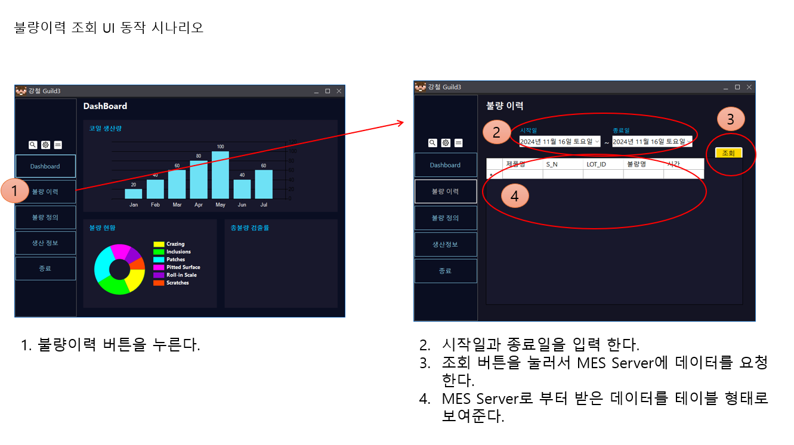

## gRPC를 MES 프로젝트에 적용하기

### Client 프로그램에 데이터 표시 하기
저희 프로젝트에는 아래 화면과 같은 요구사항 및 기능이 존재합니다.
이 기능의 구현 개념과 과정을 통해서 gRPC에 대해서 좀더 깊이 이해해 보도록 하겠습니다.



### MES Server가 없다면 데이터는 어떻게 표시 할 것인가?
조회 버튼을 눌렀을 때 데이터 그리드에 정보를 추가하려면 아래와 같은 형태의 코드가 필요 할 것입니다.

```csharp
   private void button6_Click(object sender, EventArgs e)
   {
        dataGridView1.Rows.Add("제품명", "S/N", "LOTID","불량명", "시간");       
   }
```

제품명, S/N, LOTID, 불량명, 시간을 하나의 데이터 형식으로 묶어서 관리하면 편할 것 같으니 클래스로 만드는게 좋을 것 같습니다. 따라서 아래와 같은 클래스를 하나 만들어 줍니다. 이 코드는 개념을 설명하기 위한 것이고 실제로 사용되지 않을 코드 입니다.

``` csharp
    public class prodHistoryInfo : Object
    {
        public prodHistoryInfo(String prodName, String sn, String lotId, String defactCode, DateTime dt) 
        {
            _prodName = prodName;
            _serialNum = sn;
            _lotId = lotId;
            _defactCode = defactCode;
            _produceDay = dt;
        }

        public String _prodName;
        public String _serialNum;
        public String _lotId;
        public String _defactCode;
        public DateTime _produceDay;
    }

```

저희는 prodHistoryInfo를 어떤 함수를 통해서 받아오면 코드가 간결해지고 분명해 지겠군요. 따라서 다음과 같은 함수를 기대 합니다.

``` csharp
    // 함수명 : 제품의 생산 이력을 요청 한다.
    // 파라메터 : 조회를 위해 시작일과 종료일을 지정한다.
    // 반환 : prodHistoryInfo 타입을 Queue에 넣어서 여려개 반환한다.
    Queue<prodHistoryInfo> reqProdHistory(DateTime startTime, DateTime endTime); 
```

이 함수의 형태도 좋지만 파라메터도 클래스 형태로 만들고 반환받는 부분도 좀더 다듬어 봅시다.

``` csharp
    public class prodHistoryInfoReply : Object
    {
        public prodHistoryInfoReply()
        {
        }
        int errorCode; // 반환 결과
        Queue<prodHistoryInfo> prodHistoryInfos;
    }

    public class prodHistoryInfoRequest : Object
    {
        public prodHistoryInfoRequest()
        {            
        }
        String startTime; // yyyy-mm-dd hh:mm:ss
        String endTime;   // yyyy-mm-dd hh:mm:ss
    }
```

이렇게 함수의 형태를 다듬는다면 아래와 같은 형태가 될 것입니다.

``` csharp
    // 함수명 : 제품의 생산 이력을 요청 한다.
    // 파라메터 : 조회를 위해 시작일과 종료일을 지정한다.
    // 반환 : prodHistoryInfo 타입을 Queue에 넣어서 여려개 반환한다. 반역 함수 호출 실패 시 에러값을 반환한다.
    prodHistoryInfoReply reqProdHistory(prodHistoryInfoRequest req);
```

함수의 형태가 지난 시간에 실습했던 gRPC의 service와 message 형태와 비슷해졌습니다.
이런 함수들은 DB 조회라는 유사한 목적과 용도를 가지고 있으니 DB_Service라는 클래스를 만들어서 함수들을 모아두면 좀더 편리 할 것 같습니다. 따라서 다음과 같은 클래스를 만들어 줍니다.

``` csharp
    public class DB_Service : Object
    {
        public DB_Service()
        {
        }

        // 함수명 : 제품의 생산 이력을 요청 한다.
        // 파라메터 : 조회를 위해 시작일과 종료일을 지정한다.
        // 반환 : prodHistoryInfo 타입을 Queue에 넣어서 여려개 반환한다. 반역 함수 호출 실패 시 에러값을 반환한다.
        public prodHistoryInfoReply reqProdHistory(prodHistoryInfoRequest req)
        {
            // 테스트를 위해 가짜 데이터를 만들어서 넣어 주도록 하겠습니다.
            // req.startTime, req.endTime을 이용하여 DB 데이터를 조회한다.
            // 조회된 DB 정보를 prodHistoryInfoReply에 채워서 반환 한다.
            prodHistoryInfoReply reply = new prodHistoryInfoReply();
            reply.errorCode = 0; // no error, error가 있을 때는 error code를 정의해서 반환
            reply.prodHistoryInfos.Enqueue(new prodHistoryInfo("A", "0001", "lot A", "defact A", DateTime.Now));
            reply.prodHistoryInfos.Enqueue(new prodHistoryInfo("B", "0002", "lot A", "defact B", DateTime.Now));

            return reply;
       }
    }
```

전체적인 코드를 보면 아래와 같습니다.

``` csharp

namespace Project_SteelMES
{
    public class prodHistoryInfo : Object
    {
        public prodHistoryInfo(String prodName, String sn, String lotId, String defactCode, DateTime dt) 
        {
            _prodName = prodName;
            _serialNum = sn;
            _lotId = lotId;
            _defactCode = defactCode;
            _produceDay = dt;
        }

        public String _prodName;
        public String _serialNum;
        public String _lotId;
        public String _defactCode;
        public DateTime _produceDay;
    }

    public class prodHistoryInfoReply : Object
    {
        public prodHistoryInfoReply()
        {
            prodHistoryInfos = new Queue<prodHistoryInfo>();
        }
        public int errorCode=0; // 반환 결과
        public Queue<prodHistoryInfo> prodHistoryInfos;
    }

    public class prodHistoryInfoRequest : Object
    {
        public prodHistoryInfoRequest(String tStart, String tEnd)
        {
            startTime = tStart;
            endTime = tEnd;
        }
        public String startTime; // yyyy-mm-dd hh:mm:ss
        public String endTime;   // yyyy-mm-dd hh:mm:ss
    }

    public class DB_Service : Object
    {
        public DB_Service() 
        { 
        }

        // 함수명 : 제품의 생산 이력을 요청 한다.
        // 파라메터 : 조회를 위해 시작일과 종료일을 지정한다.
        // 반환 : prodHistoryInfo 타입을 Queue에 넣어서 여려개 반환한다. 반역 함수 호출 실패 시 에러값을 반환한다.
        public prodHistoryInfoReply reqProdHistory(prodHistoryInfoRequest req) 
        {
            // 테스트를 위해 가짜 데이터를 만들어서 넣어 주도록 하겠습니다.
            // req.startTime, req.endTime을 이용하여 DB 데이터를 조회한다.
            // 조회된 DB 정보를 prodHistoryInfoReply에 채워서 반환 한다.
            prodHistoryInfoReply reply = new prodHistoryInfoReply();
            reply.errorCode = 0; // no error, error가 있을 때는 error code를 정의해서 반환
            reply.prodHistoryInfos.Enqueue(new prodHistoryInfo("A", "0001", "lot A", "defact A", DateTime.Now));
            reply.prodHistoryInfos.Enqueue(new prodHistoryInfo("B", "0002", "lot A", "defact B", DateTime.Now));
            reply.prodHistoryInfos.Enqueue(new prodHistoryInfo("C", "0003", "lot A", "defact C", DateTime.Now));
            reply.prodHistoryInfos.Enqueue(new prodHistoryInfo("D", "0004", "lot A", "defact D", DateTime.Now));
            reply.prodHistoryInfos.Enqueue(new prodHistoryInfo("E", "0005", "lot A", "defact E", DateTime.Now));
            reply.prodHistoryInfos.Enqueue(new prodHistoryInfo("F", "0006", "lot A", "defact F", DateTime.Now));

            return reply;
        }
    }
    public partial class Lost2 : LostForm
    {
        public Lost2()
        {
            db_service = new DB_Service();
            InitializeComponent();
        }
        DB_Service db_service;

        private void Lost2_Load(object sender, EventArgs e)
        {

        }

        private void button6_Click(object sender, EventArgs e)
        {
            // 제품명, S/N, LOTID, 불량명, 시간
            var reply = db_service.reqProdHistory(new prodHistoryInfoRequest("2024-11-16 00:00:00", "2024-11-16 23:59:59"));
            if(reply.errorCode == 0)
            {
                foreach (var h in reply.prodHistoryInfos)
                {
                    dataGridView1.Rows.Add(h._prodName, h._serialNum, h._lotId, h._defactCode, h._produceDay.ToString());
                }
            }
            else
            {
                // error message
            }
        }
    }
}
```

이렇게 DB_Service라는 클래스가 제공하는 reqProdHistory 함수를 통해서 원하는 정보의 조건을 함수의 인자로 전달하고 해당 조건에 맞는 데이터를 prodHistoryInfoReply 클래스로 전달 받을 수 있었습니다.
RPC는 이러한 함수가 원격에 있고 이런 원격에 있는 함수들을 호출해서 사용하는 방식이라고 생각하시면 됩니다.

* 서비스 : 유사한 기능들을 묶어서 어떠어떠한 서비스라고 이름 붙인 것
* 함수명 : reqProdHistory와 같이 특정한 기능을 정의하는 함수의 이름
* 메시지 : 함수 호출 시 전달하는 매개 변수, 그리고 함수 호출 후 반환 받는 데이터의 정의

### reqProdHistory 함수의 발전 과정
함수의 변화 과정을 살펴 보면 gRPC의 서비스와 메시지가 왜 그런 형태가 되었는지 좀더 이해하는데 도움이 될 것 입니다. 

``` csharp
    // 1단계 : from, to 시간을 인자로 넣어 주면 생산 이력을 prodHistoryInfo 클래스에 담아서 반환한다.
    prodHistoryInfo reqProdHistory(String fromTime, String toTime);

    // 2단계 : from, to 시간을 인자로 넣어 주면 생산 이력을 Queue<prodHistoryInfo>에 담아서 목록 형태로 반환한다.
    Queue<prodHistoryInfo> reqProdHistory(String fromTime, String toTime);

    // 3단계 : 매개변수는 prodHistoryInfoRequest 클래스로 만들고 반환 타입도 prodHistoryInfoReply 클래스로 만들어서 하나의 타입으로 정의하여 좀더 간편하게 한다. 
    prodHistoryInfoReply reqProdHistory(prodHistoryInfoRequest request);

```

``` proto
syntax = "proto3";

package SteelMES;

// 서비스 정의
service DB_Service {
    rpc reqProdHistory (prodHistoryInfoRequest) returns (prodHistoryInfoReply) {}
}

// 요청 메시지 (제품 생산 이력)
message prodHistoryInfoRequest {
    string fromTime = 1;
    string toTime = 2;
}

// 제품 생산 정보
message prodHistoryInfo {
    string prodName = 1;
    string serialNum = 2;
    string lotId = 3;
    string defactCode = 4;
    string produceDay = 5;    
}

// 응답 메시지 (제품 생산 이력)
message prodHistoryInfoReply {
    int32 errorCode = 1;
    repeated prodHistoryInfo infos = 2;
}
```

---
### gRPC로 바꿔 보자
다음으로는 MES Server 프로그램을 만들고 MES Client에서 MES Server에 구현되어 있는 RPC를 호출해서 생산 이력을 얻어오는 데모 프로그램을 만들어 보도록 하겠습니다.

